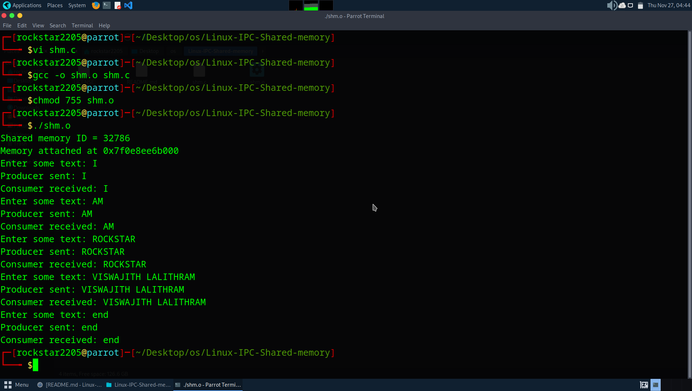
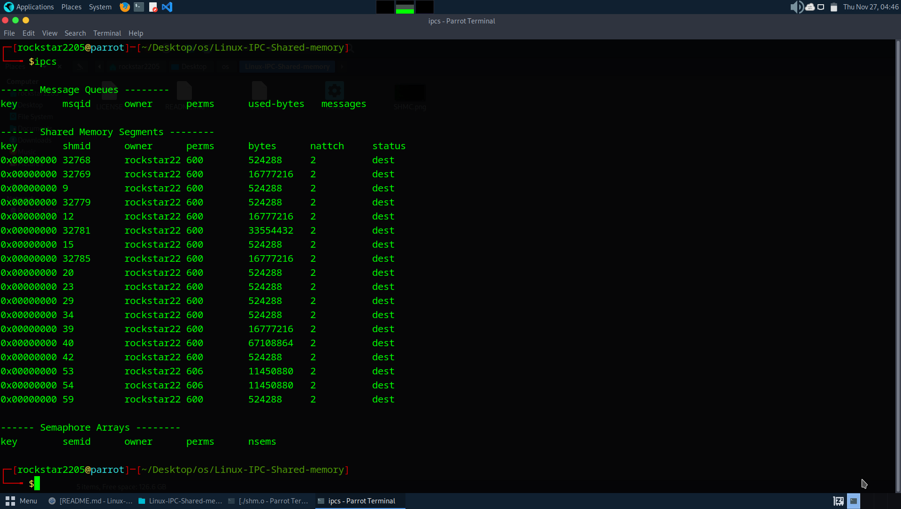

# Name : VISWAJITH LALITHRAM R.V

# Reg.No : 212224240187

# Linux-IPC-Shared-memory
Ex06-Linux IPC-Shared-memory

# AIM:
To Write a C program that illustrates two processes communicating using shared memory.

# DESIGN STEPS:

### Step 1:

Navigate to any Linux environment installed on the system or installed inside a virtual environment like virtual box/vmware or online linux JSLinux (https://bellard.org/jslinux/vm.html?url=alpine-x86.cfg&mem=192) or docker.

### Step 2:

Write the C Program using Linux Process API - Shared Memory

### Step 3:

Execute the C Program for the desired output. 

# PROGRAM:

## Write a C program that illustrates two processes communicating using shared memory.

```c

// shm.c
#include <stdio.h>
#include <stdlib.h>
#include <string.h>
#include <unistd.h>
#include <sys/shm.h>
#include <sys/types.h>
#include <sys/wait.h>

#define TEXT_SZ 2048  // Shared memory size

struct shared_use_st {
    int written;
    char some_text[TEXT_SZ];
};

int main() {
    int shmid;
    void *shared_memory = (void *)0;
    struct shared_use_st *shared_stuff;

    // Create shared memory
    shmid = shmget((key_t)1234, sizeof(struct shared_use_st), 0666 | IPC_CREAT);
    if (shmid == -1) {
        perror("shmget failed");
        exit(EXIT_FAILURE);
    }

    printf("Shared memory ID = %d\n", shmid);

    // Attach shared memory
    shared_memory = shmat(shmid, NULL, 0);
    if (shared_memory == (void *)-1) {
        perror("shmat failed");
        exit(EXIT_FAILURE);
    }

    printf("Memory attached at %p\n", shared_memory);

    shared_stuff = (struct shared_use_st *)shared_memory;
    shared_stuff->written = 0;

    pid_t pid = fork();   // <-- You MUST keep this inside main()

    if (pid < 0) {
        perror("fork failed");
        exit(EXIT_FAILURE);
    }

    /* ---------------------- CHILD : CONSUMER ---------------------- */
    if (pid == 0) {
        while (1) {
            while (shared_stuff->written == 0) {
                sleep(1); // wait for producer
            }

            printf("Consumer received: %s", shared_stuff->some_text);

            if (strncmp(shared_stuff->some_text, "end", 3) == 0) {
                shared_stuff->written = 0;
                break;
            }

            shared_stuff->written = 0;  // mark as read
        }

        // detach
        if (shmdt(shared_memory) == -1) {
            perror("shmdt failed");
            exit(EXIT_FAILURE);
        }

        exit(EXIT_SUCCESS);
    }

    /* ---------------------- PARENT : PRODUCER ---------------------- */
    else {
        char buffer[TEXT_SZ];

        while (1) {
            printf("Enter some text: ");
            fgets(buffer, TEXT_SZ, stdin);

            strncpy(shared_stuff->some_text, buffer, TEXT_SZ);
            shared_stuff->written = 1;

            printf("Producer sent: %s", buffer);

            if (strncmp(buffer, "end", 3) == 0) {
                break;
            }

            while (shared_stuff->written == 1) {
                sleep(1); // wait for consumer
            }
        }

        wait(NULL); // wait for child

        // detach and remove shared memory
        if (shmdt(shared_memory) == -1) {
            perror("shmdt failed");
            exit(EXIT_FAILURE);
        }

        if (shmctl(shmid, IPC_RMID, NULL) == -1) {
            perror("shmctl failed");
            exit(EXIT_FAILURE);
        }

        exit(EXIT_SUCCESS);
    }
}


```


## OUTPUT








# RESULT:
The program is executed successfully.
